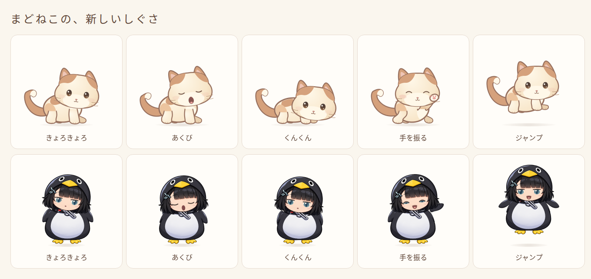
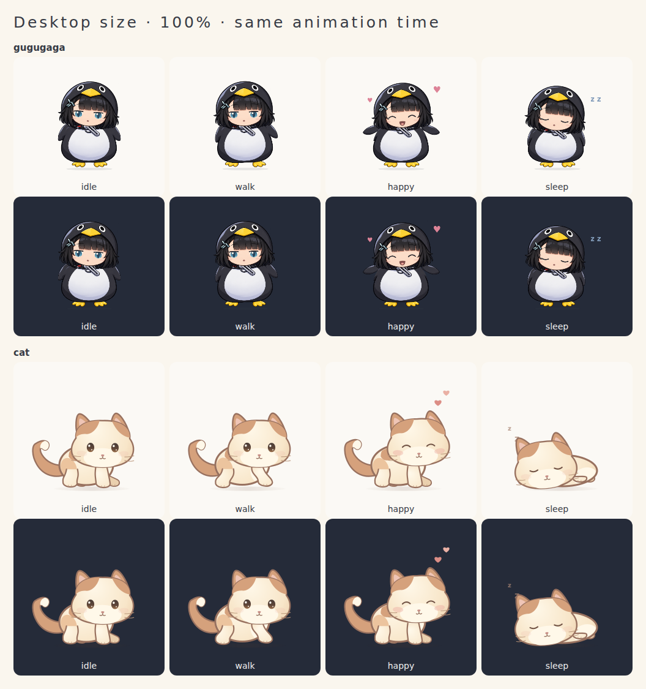

# まどねこ / MadoNeko

Windows 11のデスクトップで、猫やググガガと暮らす小さなペットアプリです。なでる、ドラッグする、ごはんをあげる、遊ぶ、眠る。設定からキャラクターを切り替えられます。

**[Windows版をダウンロード](https://github.com/Komikomi703/pets/releases/latest)**

## 使い始める

1. [Windows版ZIP](https://github.com/Komikomi703/pets/releases/latest/download/MadoNeko_1.1.0_windows_x64.zip) をダウンロードします。
2. ZIPを右クリックして「すべて展開」し、中の `MadoNeko.exe` を起動します。
3. ペットが表示され、初回は「お世話と設定」が開きます。

対応：**Windows 11 x64**。WebView2 Runtimeが必要です。アプリは未署名のため、Windowsから発行元の確認が表示される場合があります。macOS・Linux向けアプリは今回のリリースには含みません。

## 操作

- **クリック**：なでる。**ドラッグ**：移動。**右クリック**：メニュー。
- **お世話と設定**：キャラクター、名前、大きさ、速さ、性格などを変更。ごはん・なでる・遊ぶもできます。
- **通知領域のトレイアイコン**：表示／非表示、設定、給餌、集中モード、画面内への復帰、終了。
- **集中モード**：ペットの背後へクリックを通します。解除はトレイから行います。
- 設定画面を閉じてもペットは動き続けます。終了は右クリックまたはトレイの「まどねこを終了」です。

名前・育成値・選択したキャラクター・位置は保存されます。音とWindows起動時の自動開始は初期オフ。アカウントやAIサービスへの接続なしで基本機能を使えます。ググガガの声は同梱していません。

## v1.1.0の新しい行動

猫とググガガの両方に、**見回す・あくび・匂いをかぐ・手を振る・小さくジャンプ**の5種類を追加しました。猫は15状態、ググガガは19状態になりました。

- おっとりした子は見回し、甘えん坊は手を振り、元気な子はジャンプしやすくなります。
- 疲れているとあくびから眠り、匂いをかいだ後には毛づくろいします。
- 同じしぐさの連発を抑え、元気が少ないときはジャンプを控えます。集中モードでは静かに過ごします。



## 見た目と動き



[猫の変更前後](docs/images/cat-before-after.png) · [ググガガの変更前後](docs/images/gugugaga-before-after.png) · [動作録画](docs/images/character-motion.webm)

## 開発・ビルド

Node.js 22.12以降、pnpm 11.10.0、Rust、Visual Studio 2022 Build ToolsのC++ツールとWindows 11 SDKが必要です。Windowsローカルのフォルダーにクローンしてください。

```powershell
git clone https://github.com/Komikomi703/pets.git
cd pets
pnpm install --frozen-lockfile
pnpm check
pnpm tauri dev
```

配布用インストーラーを作る場合：

```powershell
powershell -ExecutionPolicy Bypass -File .\scripts\build-windows.ps1
```

`pnpm dev` はブラウザー用プレビューです。デスクトップの透明ウィンドウ・入力透過・トレイの確認にはWindowsアプリを使用します。WSLからWindowsへコピーする場合は `scripts/copy-to-windows.ps1` を利用できます。

ビルドしたアプリへの更新・再起動は `scripts/restart-windows.ps1` を使います。`%LOCALAPPDATA%\Programs\MadoNeko\madoneko.exe` に配置し、旧exeを指す既存のショートカットとユーザーの自動起動登録を更新します。自動起動が未登録なら有効化しません。旧ファイルと変更前の起動先は同フォルダーの `rollback-*` に保存します。Temp内のexeを直接ピン留めすると、再ビルドしても旧版が起動するため注意してください。

## 検証と制約

v1.1.0ではTypeScript・ESLint・Webビルド、単体テスト79件、Webテスト22件が成功。猫15状態・ググガガ19状態の描画、当たり判定、行動の中断、集中モードなどを確認しています。

Windows x64向け実行ファイルをクロスビルドして配布します。この更新版のWindows実機確認は未実施です。以前の実機結果は [検証記録](docs/VALIDATION.md) を参照してください。複数モニター間の異なるDPI、長時間稼働、インストーラーによる新規導入・削除は今後の確認対象です。

## ライセンス・素材

アプリのコードと独自の猫素材は [MIT](LICENSE) です。**ググガガは既存デザインを参考にした非公式の二次創作で、元作品に関する権利・再配布条件は未確認です。コードのMITライセンスがググガガの権利まで許諾するものではありません。**

[素材の記録](docs/ASSETS.md) · [依存ライブラリ](docs/DEPENDENCIES.md) · [第三者ライセンス全文](docs/THIRD_PARTY_NOTICES.txt) · [描画の調整と検証](docs/CHARACTER_REDESIGN.md)

Webから取得した参考画像、保存データ、開発者の環境情報を含む生ログはこのリポジトリには含めていません。
