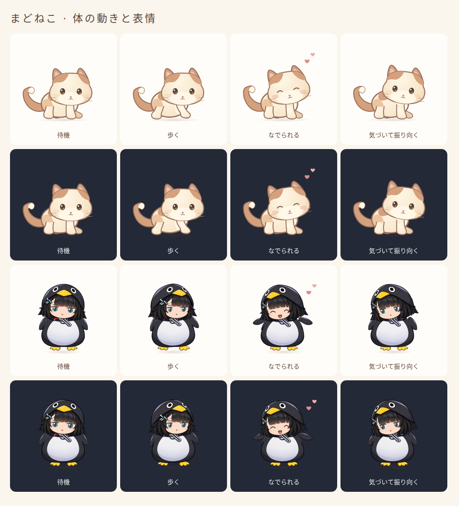

# v1.2.0の見た目と動き

## 変更内容

- 猫の肩と腰の体重移動、しっぽの遅れ、左右別々の耳の反応を追加しました。なでた方向へ顔を寄せます。
- ググガガに正面・左右斜めの頭部素材を追加し、眉・目・口の表情と髪・フードの揺れを調整しました。
- 歩き出す前の構え、ジャンプ前の沈み込み、着地後の戻りを調整しました。
- 「マウスを追いかける」がオンでカーソルが近いと、猫は様子を見てからじゃれ、ググガガは首をかしげてから手を振ります。集中モードや疲労時はこの反応を抑え、お世話やドラッグで中断します。

[動作動画](images/quality-motion.webm)はブラウザープレビューでの記録です。

## 素材

追加した頭部素材は `public/characters/gugugaga/heads-v4.png` です。[生成指示](gugugaga-v4-prompt.txt)と[素材・権利の記録](ASSETS.md)を参照してください。ググガガは非公式の二次創作で、元作品に関する権利・再配布条件は未確認です。

## 配布と更新

Windows 11 x64向けのZIPを展開して `MadoNeko.exe` を起動します。WebView2 Runtimeが必要です。更新時は旧版をトレイから終了してから、新版を起動してください。アプリは未署名です。

この更新版のWindows実機確認は未実施です。複数モニター間の異なるDPI、長時間稼働、インストーラーによる導入・削除は未確認です。過去の実機検証は[検証記録](VALIDATION.md)を参照してください。

## 今回の自動検証（2026-10-09）

- TypeScript型検査・ESLint・単体テスト100件・Webビルド：成功。
- Playwrightのブラウザーテスト23件：成功。
- Rustフォーマット検査・Windows x64向けリリースビルド：成功。外部MSVCのデバッグ用PDB欠落警告（LNK4099）はありますが、リンクは成功しています。
- 配布ZIPの整合性、実行ファイルのx64形式とバージョン1.2.0、旧版と異なる実行ファイルであることを確認しました。
